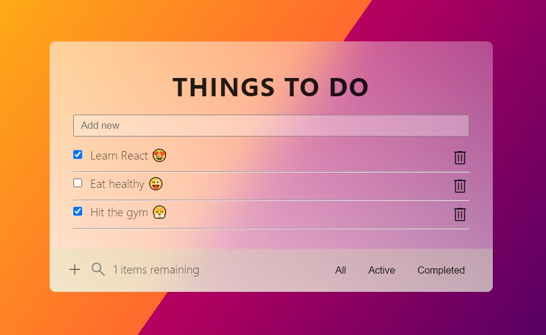

# React Todo App


This is a simple Todo app built with React, allowing users to create, update and delete tasks.

## Deployed Page

[](https://gilded-melomakarona-432a0c.netlify.app)(https://gilded-melomakarona-432a0c.netlify.app)

## Demo




## Deployment

To deploy this project run

```bash
  npm run deploy
```


## 🛠 Skills
React,Javascript, HTML, CSS...


## Feedback

If you have any feedback, please reach out to me


